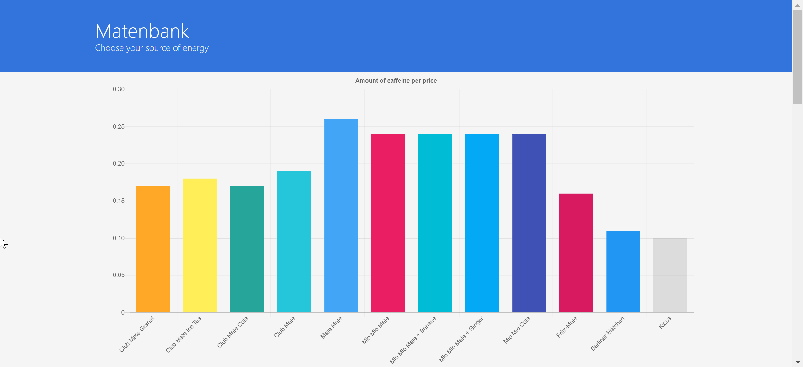
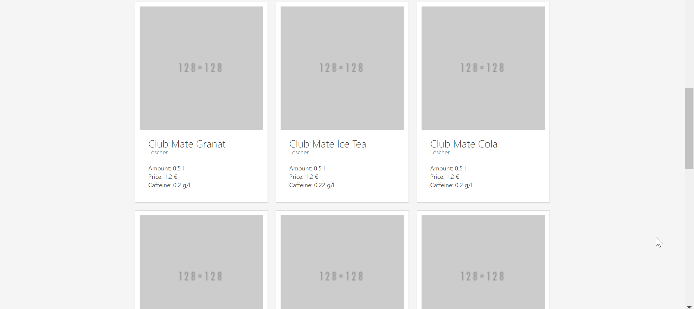

# Mate my day





> An overview and comparison of different mate-softdrinks.

## Getting started

``` bash
# install dependencies
npm install

# serve with hot reload at localhost:8080
npm run dev

# build for production with minification
npm run build
```

## Configuration

### Add a softdrink

To add a softdrink go to `src\data\mate.json` and add a object to the array.

```js
[
  {
    "name": "Club Mate Granat",
    "producer": "Loscher",
    "liter": 0.5,
    "price": 1.2,
    "caffeine": 0.2
  }
]
```

## Built With

* [Vue.js](https://vuejs.org/) - The web framework used
* [Bulma](https://bulma.io/) - The css framework used
* [Chart.js](http://www.chartjs.org/) - JavaScript for different charts

## Licensing

The code in this project is licensed under MIT license.
